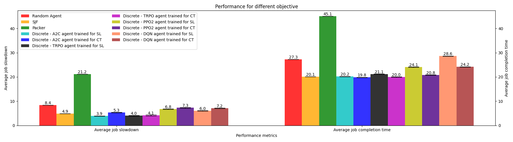
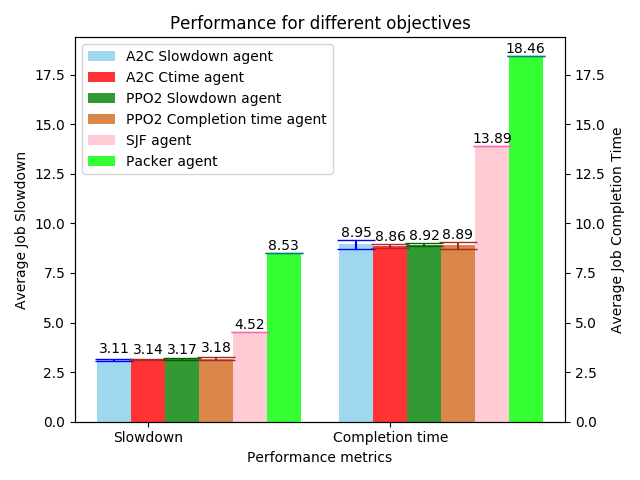

# Scheduling

**Members**

* Tejas Ravindra Dhawale
* Kunal Sisodia
* Aluri Mohini

## Problem Statement :

Resource management is one of the ever-present problems in the networking and computer systems domain. One such example is cluster scheduling and assigning sufficient resources for the execution of the jobs. We mainly focus on cluster scheduling problem where we have incoming jobs which needs multiple resources for their execution. Our work is based on the paper [Resource Management with Deep Reinforcement Learning](https://people.csail.mit.edu/alizadeh/papers/deeprm-hotnets16.pdf).

## Implementation Overview :

Reinforcement Learning is used so that systems can learn to manage the resources on their own and without any human intervention. We primarily make use of [Stable Baselines framework](https://stable-baselines.readthedocs.io/en/master/) for training of our agents. We
also compare the performance of trained agents with heuristic-based scheduling approaches like 
Shortest-Job-First (SJF) and Packer. We created a custom environment, and use two different approaches (Discrete and Multi-Binary Environments) for tackling the problem. In Discrete Environment, we take discrete
actions and choose one job every step function call (multiple jobs per timestep), while in Multi-Binary Environment, we choose a subset of jobs, giving them access to the machine resources for execution.

## State Space :

The state space consists of the 
* The current state of the machine ,
* The resource requirements of the jobs and,
* Summarized job backlog.

## Action Space :

We have two different action spaces for two different environments.

**Discrete Action Space :**
* Size of action space =  Number of job slots + 1.
* Select one or more jobs from the job slots at each timestep.

**Multi-Binary Action Space :**
* Size of action space =  Number of job slots.
* Select subset of jobs from the job slots at each timestep.

## Reward Function :

We have different rewards based on different agent objective. 

**Reward for objective – Minimize average job slowdown :**
* *-1/job* length for all jobs present in the system i.e. jobs currently running on the 
machine, jobs in the job slots and the jobs in the job backlog.
* We do not reward the agent for intermediate decisions during a timestep.

**Reward for objective - Minimize average job completion time :**
* *-|J|*, where *J* specifies the number of unfinished jobs in the system at each timestep.
* We do not reward the agent for intermediate decisions during a timestep.

## Experimental Evaluations :

**Discrete Action Space Environment :**

We trained A2C, TRPO, DQN and PPO2 agents which support the discrete action space for 1000 training iterations for both the objectives. The results shown in below graph, also indicate that the trained agents (A2C and TRPO) performed better than that of heuristic-based approaches based on the objective function.

###### Performance Graph for Discrete Environment

**Multi-Binary Action Space Environment :**

We trained two stable baseline agent, i.e. A2C and PPO2 which support the multi-binary action
space for 1000 training iterations for both the objectives. The results shown in below graph
clearly indicate that the trained agents performed better than that of heuristic-based approaches.

###### Performance Graph for Multi-binary Environment

## Phases of implemenation. 

## Phase 1 -- Learning

1) Designing the Job scheduling Enviroment
2) Finalizing the factors Discounts, learning curves, baselines methods DRL, Tensor flow, theano, entropy, input samples.
3) Finalize all the input parameters like - output freq, job length, timespan, new job rate, etc
4) Designing Job Distribution - Defining work distribution, resources required, Job sequence.
5) Agent Design and Training
6) Designing Network - containing state, actions reward, neural network design for training
7) Slow down calculations.
8) Designing inputs or getting it from a source
9) Familiarise with libraries - theano, numpy, cPickle,lasagne, Tensorflow,DRL Techniques.
10) Comparing the obtained results with the original paper

## Phase 2 -- Enhancements 

1) Performance improvements using raytune with different parameters for both the environment.
2) Comparing Discrete environment Vs Multi-Binary environment.
3) Modified [observation space](https://github.com/CN-UPB/pg-aicon/blob/master/Scheduling/documentation/Employing_Reinforcement_Learning_Algorithms_to_solve_Cluster_Scheduling_Problem.pdf) for improved performance.
4) Evaluate performance subjected to varying load.
5) Enhanced Workload determination.
6) Train multiple agents.
7) Compare results with [paper](https://people.csail.mit.edu/alizadeh/papers/deeprm-hotnets16.pdf).

## Input :

* [Learning scheduling algorithms for data processing clusters](https://web.mit.edu/decima/content/sigcomm-2019.pdf)
* [Resource Management with Deep Reinforcement Learning](https://people.csail.mit.edu/alizadeh/papers/deeprm-hotnets16.pdf)
* [Variance Reduction for Reinforcement Learning in Input-driven Environments](https://people.csail.mit.edu/malte/pub/papers/2019-iclr-variance.pdf)
